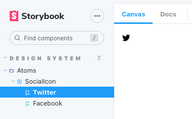

# Storybook をインストールする

公式：https://storybook.js.org/

## インストール

```bash
# インストール
npx sb@latest init

# 起動コマンド
npm run storybook
```

## アドオンを追加

[TypeScript と React/Next.js でつくる実践 Web アプリケーション開発](https://amzn.to/3CyPF89) を参考にした

```bash
# アドオンを追加
npm install --save-dev @storybook/addon-postcss tsconfig-paths-webpack-plugin @babel/plugin-proposal-class-properties @babel/plugin-proposal-private-methods @babel/plugin-proposal-private-property-in-object @mdx-js/react

# それぞれインストールする場合は以下
npm install --save-dev @storybook/addon-postcss
npm install --save-dev tsconfig-paths-webpack-plugin
npm install --save-dev @babel/plugin-proposal-class-properties
npm install --save-dev @babel/plugin-proposal-private-methods
npm install --save-dev @babel/plugin-proposal-private-property-in-object
npm install --save-dev @mdx-js/react
```

## `main.js`にアドオン/アセットを読み込ませるよう記述

`.storybook/main.js`

```diff
+ const TsconfigPathsPlugin = require("tsconfig-paths-webpack-plugin");
+ const path = require("path");

  export default {
    stories: ["../src/**/*.stories.mdx", "../src/**/*.stories.@(js|jsx|ts|tsx)"],
    addons: [
      "@storybook/addon-links",
      "@storybook/addon-essentials",
      "@storybook/addon-interactions",
+     "@storybook/addon-postcss",
    ],
+   staticDirs: ["../public"],
+   babel: async (options) => ({
+     ...options,
+     plugins: [
+       "@babel/plugin-proposal-class-properties",
+       "@babel/plugin-proposal-private-methods",
+       "@babel/plugin-proposal-private-property-in-object",
+     ],
+   }),
+   webpackFinal: async (config) => {
+     config.resolve.plugins = [
+       new TsconfigPathsPlugin({
+         configFile: path.resolve(__dirname, "../tsconfig.json"),
+       }),
+     ];
+
+     return config;
+   },
    framework: "@storybook/react",
    core: {
      builder: "@storybook/builder-webpack5",
    },
  };
```

参考：https://storybook.js.org/docs/react/configure/overview#configure-your-storybook-project

## `next/image`を使えるようにする

`.storybook/preview.js`に以下を追加

```diff
+ import * as NextImage from "next/image";

---

+ const OriginalNextImage = NextImage.default;

+ Object.defineProperty(NextImage, "default", {
+   configurable: true,
+   value: (props) => <OriginalNextImage {...props} unoptimized />,
+ });
```

## 使ってみる

例えば、渡された SNS の種類に応じて、`Font Awesome`で包んで返すコンポーネントを作る。

`/src/components/atoms/SocialIcon/index.tsx`

```tsx
import { FontAwesomeIcon } from "@fortawesome/react-fontawesome";
import { IconDefinition } from "@fortawesome/fontawesome-svg-core";
import { faTwitter, faFacebook } from "@fortawesome/free-brands-svg-icons";

export type SocialIconProps = {
  media: "twitter" | "facebook";
};

export default function SocialIcon(props: SocialIconProps) {
  const { media } = props;
  let iconProp: IconDefinition;

  switch (media) {
    case "twitter":
      iconProp = faTwitter;
      break;
    case "facebook":
      iconProp = faFacebook;
      break;
  }

  return <FontAwesomeIcon icon={iconProp} />;
}
```

同じ階層に`index.stories.tsx`を作成する。

`/src/components/atoms/SocialIcon/index.tsx`

```tsx
import { ComponentStory, ComponentMeta } from "@storybook/react";
import SocialIcon from "./index";

export default {
  title: "Design System/Atoms/SocialIcon",
  component: SocialIcon,
} as ComponentMeta<typeof SocialIcon>;

const Template: ComponentStory<typeof SocialIcon> = (args) => (
  <SocialIcon {...args} />
);

export const Twitter = Template.bind({});

Twitter.args = {
  media: "twitter",
};

export const Facebook = Template.bind({});

Facebook.args = {
  media: "facebook",
};
```

```bash
// ストーリーブックを起動
npm run storybook
```

こんな感じで表示される


